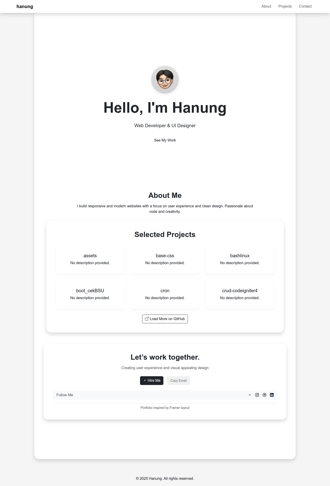

# 💼 Hanung's Developer Portfolio

Personal web portfolio built with HTML, Bootstrap 5, and custom CSS/JS. Showcases selected projects, skills, and contact information with a modern, clean UI.

## 🚀 Features

- Responsive layout (mobile-first)
- Hero section with animation
- Dynamic GitHub project fetch (via GitHub API)
- Floating navigation bar
- Smooth scroll and scrollspy
- Animated contact section with call-to-action

## 📁 Project Structure

├── index.html # Main HTML file
├── css/
│ └── style.css # Custom styles
├── js/
│ └── main.js # Scroll effects & GitHub API integration
└── assets/
└── images/ # Project thumbnails, avatar, icons


## 📷 Preview



## 📬 Contact

Want to collaborate or hire me?  
📧 [hanungsoekamti@gmail.com](mailto:hanungsoekamti@gmail.com)

---

## 🛠️ Setup & Run

1. Clone the repo
```bash
git clone https://github.com/hanungss/Portofolio
